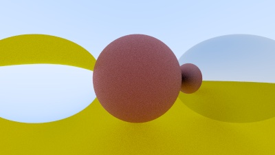

# rtow-clj

An experimental ray tracer written in Clojure. Run it with `clojure rtow.clj`.

Built on the amazing [_Ray Tracing in One Weekend_](https://raytracing.github.io/books/RayTracingInOneWeekend.html).

## License

Copyright (c) Janos Erdos. All rights reserved. The use and distribution terms for this software are covered by the Eclipse Public License 2.0 (https://www.eclipse.org/legal/epl-2.0/) which can be found in the file LICENSE.txt at the root of this distribution. By using this software in any fashion, you are agreeing to be bound by the terms of this license. You must not remove this notice, or any other, from this software.